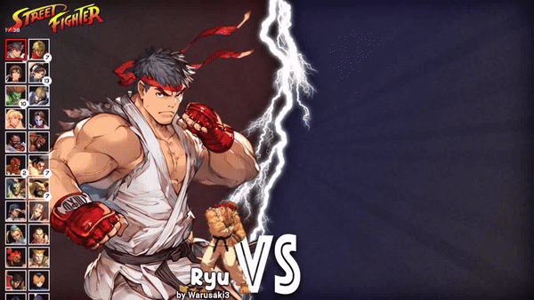

# Quick Versus Bootstrap

This is a example of a complete setup for the [Quick Versus launcher](https://github.com/ikemen-launcher/quick-versus).

You can start with this bootstrap then customize your game.

## Installation

1. Download this bootstrap project: https://github.com/ikemen-launcher/quick-versus-bootstrap/releases
2. Download the executable: https://github.com/ikemen-launcher/quick-versus/releases
3. Put the executable in the root

## How to upgrade Ikemen GO

Download Ikemen GO: https://github.com/ikemen-engine/Ikemen-GO/releases

Install Ikemen Go to have the executable here:

- Linux: `Ikemen_GO/Ikemen_GO_Linux`
- MacOS: `Ikemen_GO/Ikemen_GO_MacOS`
- Windows: `Ikemen_GO/Ikemen_GO.exe`

## How to upgrade the launcher

Download the launcher: https://github.com/ikemen-launcher/quick-versus/releases

Put the executable in the root:

- Linux: `quick-versus.AppImage`
- MacOS: `quick-versus.app`
- Windows: `quick-versus.exe`

## How to customize

For customization details, please consult https://github.com/ikemen-launcher/quick-versus
